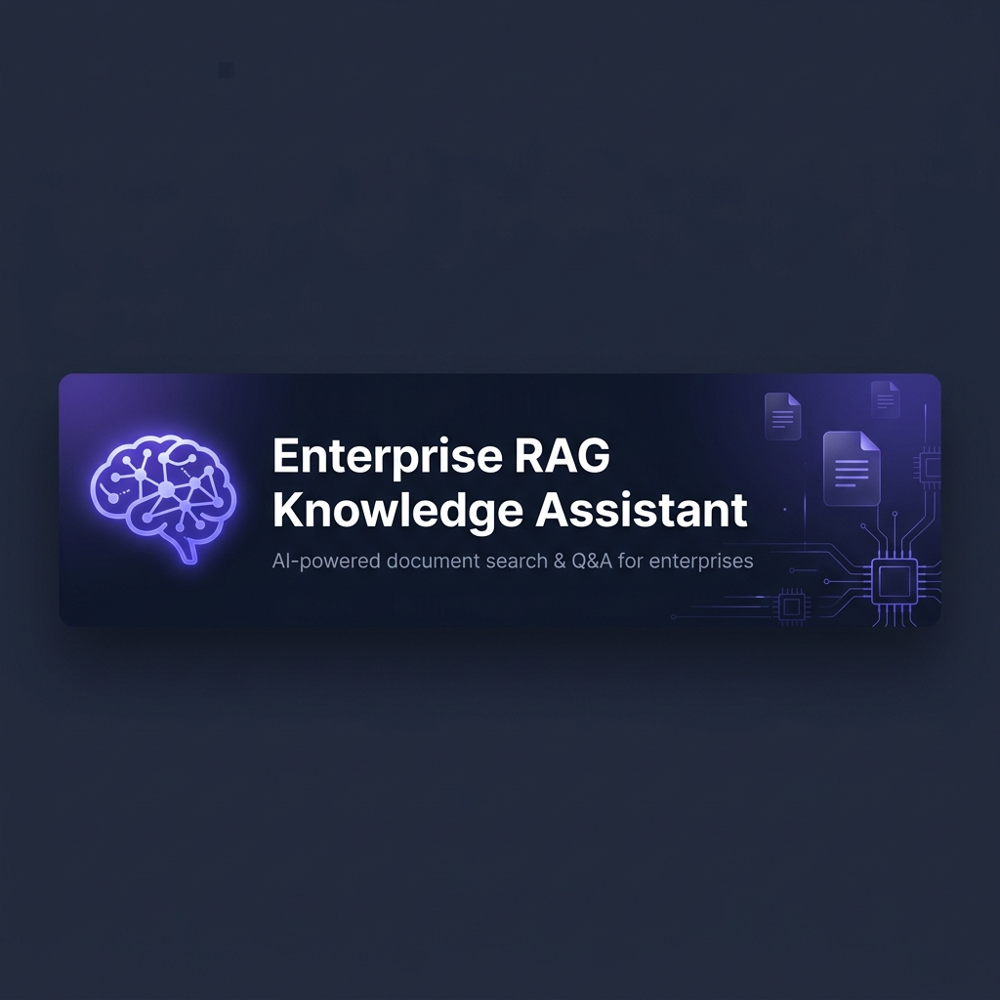

# 🧠 Enterprise RAG Knowledge Assistant

<p align="center">
  
</p>

<p align="center">
  <a href="#features"><strong>Features</strong></a> ·
  <a href="#architecture"><strong>Architecture</strong></a> ·
  <a href="#quick-start"><strong>Quick Start</strong></a> ·
  <a href="#deployment"><strong>Deployment</strong></a> ·
  <a href="#documentation"><strong>Docs</strong></a>
</p>

<p align="center">
  
  
  
  
  
  
  
</p>

---

## Overview

Enterprise RAG Knowledge Assistant is a **production-ready, cloud-native, multi-tenant** platform that enables organizations to upload, index, and intelligently chat with their internal documents using **Retrieval Augmented Generation (RAG)**.

Built for organizations that need:
- 🔒 **Enterprise security** — RBAC, SSO, audit logging, data isolation
- 📄 **Document intelligence** — PDF, DOCX, Excel, HTML, Markdown, CSV
- 🤖 **Advanced AI** — LangGraph agents, hybrid search, re-ranking, source citations
- 🏢 **Multi-tenancy** — Separate data, vectors, and permissions per organization
- 📈 **Scale** — 100K+ users, 100M+ documents, 1M+ queries/day

---

## Features

### Document Management
- Upload PDFs, DOCX, Excel, HTML, Markdown, CSV, TXT
- OCR support (Tesseract + Azure Document Intelligence)
- Intelligent chunking (Fixed, Recursive, Semantic, Parent-Child)
- Virus scanning on upload
- Versioning and metadata management

### AI / RAG Pipeline
- Multi-provider LLM: OpenAI, Anthropic, Azure OpenAI, Ollama (local)
- Multi-provider embeddings: OpenAI, BGE, Instructor, Azure
- Hybrid search: Semantic + BM25 + metadata filtering
- Cross-encoder re-ranking
- Query rewriting + intent detection
- Source citation with page references
- Hallucination reduction guardrails

### Agentic Capabilities (LangGraph)
- Research Agent
- Policy & Compliance Agent
- Document Summarizer
- Meeting Notes Generator
- Auto FAQ Generator
- Knowledge Graph Builder

### Enterprise Features
- Multi-tenancy with complete data isolation
- RBAC: Admin, Manager, Employee, Viewer
- SSO via Keycloak (Google, Azure AD, SAML, OIDC)
- Audit logging (every action tracked)
- PII masking
- Prompt injection defense
- Rate limiting + API throttling
- Cost tracking (embedding + LLM costs per org)

### Chat Interface
- ChatGPT-like streaming interface
- Conversation history + threading
- Source citations with document highlights
- Response feedback (thumbs up/down)
- Export/share conversations
- Context-aware follow-ups

### Observability
- Prometheus metrics
- Grafana dashboards
- OpenTelemetry distributed tracing
- ELK Stack centralized logging
- Alerting rules

---

## Architecture

```
┌─────────────────────────────────────────────────────────────────┐
│                         CLIENTS                                 │
│          Browser (Next.js)  │  Mobile  │  API Consumers         │
└───────────────────┬─────────────────────────────────────────────┘
                    │
┌───────────────────▼─────────────────────────────────────────────┐
│                    API GATEWAY (FastAPI)                         │
│         Auth Middleware │ Rate Limiting │ Routing                │
└──┬────────┬────────┬────────┬────────┬────────┬─────────────────┘
   │        │        │        │        │        │
┌──▼──┐ ┌──▼──┐ ┌───▼──┐ ┌──▼──┐ ┌──▼──┐ ┌──▼──┐
│Auth │ │User │ │ Doc  │ │Proc │ │Chat │ │Audit│
│ Svc │ │ Svc │ │ Svc  │ │ Svc │ │ Svc │ │ Svc │
└──┬──┘ └──┬──┘ └───┬──┘ └──┬──┘ └──┬──┘ └──┬──┘
   │        │        │       │       │        │
┌──▼────────▼────────▼───────▼───────▼────────▼──┐
│                SHARED INFRASTRUCTURE             │
│  PostgreSQL+pgvector │ Redis │ RabbitMQ │ MinIO  │
└─────────────────────────────────────────────────┘
```

See [Architecture Docs](docs/architecture/system-architecture.md) for full Mermaid diagrams.

---

## Quick Start

### Prerequisites
- Docker 24+ & Docker Compose v2
- Node.js 20+
- Python 3.12+
- Make

### 1. Clone & Configure

```bash
git clone https://github.com/manikantbindass/Enterprise-RAG-Knowledge-Assistant.git
cd enterprise-rag-knowledge-assistant
cp .env.example .env
# Edit .env with your API keys
```

### 2. Start Full Stack

```bash
make dev
```

This starts:
- Frontend: http://localhost:3000
- API Gateway: http://localhost:8000
- API Docs: http://localhost:8000/docs
- Keycloak: http://localhost:8080
- Grafana: http://localhost:3001
- RabbitMQ UI: http://localhost:15672
- MinIO Console: http://localhost:9001

### 3. Default Credentials

| Service | Username | Password |
|---------|----------|----------|
| App (Admin) | admin@enterprise.dev | admin123 |
| Keycloak | admin | admin |
| RabbitMQ | admin | admin |
| MinIO | minioadmin | minioadmin |
| Grafana | admin | admin |

> ⚠️ Change all passwords before production deployment!

---

## Deployment

### Docker Compose (Development/Staging)
```bash
make dev          # Start all services
make dev-down     # Stop all services
make logs         # Tail logs
make migrate      # Run DB migrations
make seed         # Seed test data
```

### Kubernetes (Production)
```bash
# Apply all manifests
kubectl apply -f infrastructure/kubernetes/

# Or use Helm
helm install rag-assistant infrastructure/helm/rag-assistant/ \
  --namespace rag-prod \
  --values infrastructure/helm/values.prod.yaml
```

### Terraform (AWS)
```bash
cd infrastructure/terraform/aws
terraform init
terraform plan
terraform apply
```

---

## API Documentation

- **Swagger UI**: http://localhost:8000/docs
- **ReDoc**: http://localhost:8000/redoc
- **OpenAPI JSON**: http://localhost:8000/openapi.json

---

## Tech Stack

| Layer | Technology |
|-------|-----------|
| Frontend | Next.js 15, TypeScript, TailwindCSS, ShadCN, React Query, Zustand |
| Backend | FastAPI, Python 3.12, SQLAlchemy, Alembic, Pydantic v2 |
| AI | LangChain, LangGraph, OpenAI, Anthropic, Azure OpenAI, Ollama |
| Vector DB | PostgreSQL + pgvector (primary), Pinecone/Qdrant (optional) |
| Database | PostgreSQL 16 |
| Cache | Redis 7 |
| Queue | RabbitMQ 3.13 |
| Storage | MinIO (dev), AWS S3 (prod) |
| Auth | Keycloak 24 |
| Monitoring | Prometheus, Grafana, OpenTelemetry |
| Logging | ELK Stack (Elasticsearch, Logstash, Kibana) |
| Container | Docker, Kubernetes |
| CI/CD | GitHub Actions |
| IaC | Terraform |

---

## Project Structure

```
enterprise-rag-knowledge-assistant/
├── frontend/                    # Next.js 15 application
├── backend/
│   ├── api_gateway/             # FastAPI API Gateway
│   ├── auth_service/            # Authentication & RBAC
│   ├── user_service/            # User & Organization management
│   ├── document_service/        # Document upload & metadata
│   ├── processing_service/      # OCR, extraction, chunking
│   ├── embedding_service/       # Vector embedding generation
│   ├── vector_service/          # Vector search (pgvector)
│   ├── chat_service/            # RAG pipeline (LangGraph)
│   ├── audit_service/           # Audit logging
│   ├── notification_service/    # Email & webhooks
│   └── shared/                  # Shared models, utils, config
├── infrastructure/
│   ├── docker-compose.yml       # Local development stack
│   ├── kubernetes/              # K8s manifests
│   ├── helm/                    # Helm charts
│   └── terraform/               # Infrastructure as Code
├── .github/workflows/           # CI/CD pipelines
├── docs/                        # Architecture & API docs
├── monitoring/                  # Prometheus & Grafana configs
├── tests/                       # Integration & load tests
├── scripts/                     # Migrations & utilities
└── Makefile                     # Developer shortcuts
```

---

## Security

- OWASP Top 10 protections
- JWT with short expiry + refresh tokens
- OAuth2 + OIDC (Keycloak)
- RBAC with row-level security
- Encryption at rest (AES-256) and in transit (TLS 1.3)
- Secrets management (HashiCorp Vault ready)
- PII detection and masking
- Prompt injection defense
- RAG poisoning defense
- Rate limiting (per-user, per-org, per-IP)
- File validation (type, size, virus scan)

See [Security Documentation](docs/security/security-guide.md).

---

## License

MIT License — see [LICENSE](LICENSE)

---

## Contributing

See [CONTRIBUTING.md](CONTRIBUTING.md)

---

## Support

- 📖 [Documentation](docs/)
- 🐛 [Issue Tracker](https://github.com/manikantbindass/Enterprise-RAG-Knowledge-Assistant/issues)
  - 💬 [Discussions](https://github.com/manikantbindass/Enterprise-RAG-Knowledge-Assistant/discussions)
