<p align="center">
  
</p>

<p align="center">
  
  
  
  
  
  
</p>

<p align="center">
  <a href="#-quick-start"><strong>Quick Start</strong></a> ·
  <a href="#-features"><strong>Features</strong></a> ·
  <a href="#-architecture"><strong>Architecture</strong></a> ·
  <a href="#-backend-setup"><strong>Backend</strong></a> ·
  <a href="#-deployment"><strong>Deploy</strong></a>
</p>

---

A **production-grade, full-stack RAG (Retrieval Augmented Generation) platform** that lets your organization upload documents, ask questions, and get accurate AI answers with source citations — all with zero mock data and a fully functional frontend-native search engine.

---

## ✨ Features

### 📄 Document Management
- **Drag-and-drop upload** — PDF, DOCX, TXT, MD, CSV, JSON, XLSX, code files and more
- **Department tagging** — Legal, HR, Finance, IT, Engineering, Sales, Product, Marketing
- **Real text extraction** — Browser-native `FileReader` for all text-based formats
- **Processing pipeline** — `uploading → processing → indexed` state machine with live progress
- **Preview modal** — See extracted text and chunk count before querying
- Search, filter by status, delete — all live from state

### 💬 AI Chat (RAG)
- **BM25 search engine** — Runs fully in the browser over your indexed document chunks
- **Context-aware answers** — Detects question type (summary / list / direct) and formats accordingly
- **Source citations** — Every answer shows the exact excerpts used with match %
- **Inline file attach** — Attach a text file in chat for one-off search without indexing
- **Streaming responses** — Typewriter effect with animated cursor
- **Conversation history** — All chats persist across sessions, fully deletable
- Empty KB guidance — tells you exactly what to upload when knowledge base is empty

### 📊 Dashboard
- **Starts completely empty** — zero mock data, all stats computed from real state
- Recharts line chart: queries per day (last 30 days)
- Recharts bar chart: documents by department
- Cost estimator: LLM + embedding cost based on actual usage
- Beautiful empty-state CTA cards on first login

### ⚙️ Settings
- Model selector: GPT-4o / Claude 3.5 / GPT-3.5 / Ollama
- Chunk size, Top-K, Temperature sliders — actually affect RAG search
- Export knowledge base as JSON
- Clear all data (with confirmation)
- API key management (show/hide + auto-generate)

### 👥 Admin Panel
- Invite users → persisted to store (name, email, role, department)
- Real security controls dashboard
- Usage analytics from actual query logs
- User query leaderboard

---

## 🏗 Architecture

```
┌─────────────────────────────────────────────────────────────────┐
│                     Browser (Next.js 15)                        │
│                                                                 │
│  ┌──────────────┐  ┌──────────────┐  ┌──────────────────────┐  │
│  │  Documents   │  │     Chat     │  │  Dashboard / Admin   │  │
│  │   Page       │  │    Page      │  │      / Settings      │  │
│  └──────┬───────┘  └──────┬───────┘  └──────────┬───────────┘  │
│         │                 │                      │              │
│  ┌──────▼─────────────────▼──────────────────────▼───────────┐  │
│  │               AppStore (useReducer + localStorage)        │  │
│  │   documents[] · conversations[] · queryLogs[] · settings  │  │
│  └──────────────────────────┬───────────────────────────────┘   │
│                             │                                   │
│  ┌──────────────────────────▼───────────────────────────────┐   │
│  │              RAG Engine (client-side)                    │   │
│  │   buildChunks() · ragSearch() BM25 · formatAnswer()      │   │
│  └──────────────────────────────────────────────────────────┘   │
└──────────────────────────────┬──────────────────────────────────┘
                               │ (optional)
┌──────────────────────────────▼──────────────────────────────────┐
│                Python Backend (FastAPI)                         │
│   PDF/DOCX parsing · OpenAI embeddings · pgvector search       │
│   LangGraph agents · SSO · Multi-tenancy · Audit logs          │
└─────────────────────────────────────────────────────────────────┘
```

**Frontend-only mode** (default, no backend needed):
- Text files (.txt, .md, .csv, .json, code) → real content extraction + BM25 search
- All state persisted in `localStorage` (`rag_app_v2` key)
- Zero external dependencies to run

**Full-stack mode** (with Python backend):
- Binary file parsing (PDF → text via PyMuPDF, DOCX via python-docx)
- OpenAI/Azure embeddings + pgvector semantic search
- SSO (Google/Azure AD), multi-tenant RBAC, audit logging

---

## 🚀 Quick Start

### Frontend Only (no backend required)

```bash
git clone https://github.com/manikantbindass/Enterprise-RAG-Knowledge-Assistant.git
cd Enterprise-RAG-Knowledge-Assistant/frontend
npm install
npm run dev
```

Open **http://localhost:3000** — sign in with any email/password.

> **Tip:** Upload `.txt`, `.md`, `.csv`, or `.json` files — the app extracts text and enables RAG search immediately, no backend needed.

---

## 🐍 Backend Setup

The Python backend unlocks PDF/DOCX parsing, vector embeddings, and LLM integration.

### Prerequisites
- Docker + Docker Compose
- OpenAI API key (or Azure OpenAI)

### Start with Docker

```bash
# Copy and configure environment
cp .env.example .env
# Set OPENAI_API_KEY and other vars in .env

# Start all services
docker compose up -d

# Services:
#   Frontend:  http://localhost:3000
#   API:       http://localhost:8000
#   API Docs:  http://localhost:8000/docs
#   pgAdmin:   http://localhost:5050
```

### Environment Variables

```env
# Required
OPENAI_API_KEY=sk-...
DATABASE_URL=postgresql://rag:rag@db:5432/ragdb
SECRET_KEY=your-secret-key-here

# Optional
AZURE_OPENAI_ENDPOINT=
ANTHROPIC_API_KEY=
OLLAMA_BASE_URL=http://localhost:11434
```

---

## 📁 Project Structure

```
Enterprise-RAG-Knowledge-Assistant/
├── frontend/                    # Next.js 15 App Router
│   └── src/
│       ├── app/
│       │   ├── page.tsx         # Login page
│       │   └── (dashboard)/
│       │       ├── layout.tsx   # AppStoreProvider wrapper
│       │       ├── dashboard/   # Analytics & empty state
│       │       ├── documents/   # Upload + manage KB
│       │       ├── chat/        # RAG chat interface
│       │       ├── settings/    # Model & retrieval config
│       │       └── admin/       # User management
│       ├── components/layout/   # Sidebar, Header
│       └── lib/
│           ├── store.tsx        # AppStore + BM25 RAG engine
│           └── utils.ts         # Helpers
├── backend/                     # Python FastAPI (optional)
│   ├── app/
│   │   ├── api/                 # REST endpoints
│   │   ├── services/            # RAG pipeline, embeddings
│   │   └── models/              # SQLAlchemy models
│   └── requirements.txt
├── docker-compose.yml
└── README.md
```

---

## 🔑 How RAG Works (Frontend Mode)

1. **Upload** a text file → `FileReader` extracts raw text
2. **Chunk** → `buildChunks()` splits by paragraph (400 words default)
3. **Index** → chunks stored in `AppStore` (localStorage)
4. **Query** → `ragSearch()` tokenizes query, scores all chunks with BM25
5. **Answer** → `formatAnswer()` builds context-aware Markdown from top-K hits
6. **Cite** → sources shown as collapsible cards with excerpt + match %

---

## 🚀 Deployment

### Vercel (Frontend)
```bash
cd frontend
npx vercel --prod
```

### Railway / Render (Full Stack)
```bash
# Set environment variables in dashboard
# Deploy with Dockerfile
docker build -t rag-app .
docker run -p 3000:3000 rag-app
```

---

## 🛡 Security

- Route protection via Next.js middleware (`rag_session` cookie)
- RBAC: admin / manager / user roles
- Session cookie: `HttpOnly; SameSite=Lax; Secure` (production)
- No data sent to external services in frontend-only mode
- All content stays in your browser's localStorage

---

## 📄 License

MIT — free for personal and commercial use.

---

<p align="center">Built with ❤️ using Next.js 15, TypeScript, Framer Motion, and a client-side BM25 RAG engine</p>
