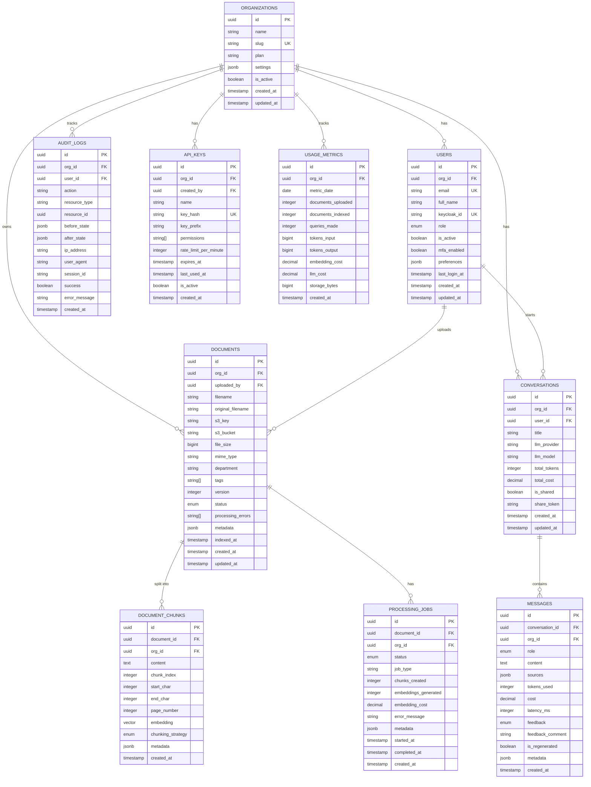

# Database Schema — Enterprise RAG Knowledge Assistant

## ER Diagram



---

## Full SQL Schema

```sql
-- ============================================================
-- Extensions
-- ============================================================
CREATE EXTENSION IF NOT EXISTS "uuid-ossp";
CREATE EXTENSION IF NOT EXISTS "vector";
CREATE EXTENSION IF NOT EXISTS "pg_trgm";     -- fuzzy text search
CREATE EXTENSION IF NOT EXISTS "btree_gin";   -- composite indexes

-- ============================================================
-- Enums
-- ============================================================
CREATE TYPE user_role AS ENUM ('admin', 'manager', 'employee', 'viewer');
CREATE TYPE document_status AS ENUM (
    'pending', 'uploading', 'uploaded', 'processing',
    'chunking', 'embedding', 'indexed', 'failed', 'archived'
);
CREATE TYPE job_status AS ENUM (
    'queued', 'running', 'completed', 'failed', 'retrying'
);
CREATE TYPE message_role AS ENUM ('user', 'assistant', 'system');
CREATE TYPE feedback_type AS ENUM ('positive', 'negative', 'neutral');
CREATE TYPE chunking_strategy AS ENUM (
    'fixed', 'recursive', 'semantic', 'parent_child'
);

-- ============================================================
-- Organizations
-- ============================================================
CREATE TABLE organizations (
    id              UUID PRIMARY KEY DEFAULT uuid_generate_v4(),
    name            VARCHAR(255) NOT NULL,
    slug            VARCHAR(100) NOT NULL UNIQUE,
    plan            VARCHAR(50) NOT NULL DEFAULT 'free',
    settings        JSONB NOT NULL DEFAULT '{}',
    is_active       BOOLEAN NOT NULL DEFAULT TRUE,
    max_documents   INTEGER NOT NULL DEFAULT 10000,
    max_users       INTEGER NOT NULL DEFAULT 50,
    max_storage_gb  INTEGER NOT NULL DEFAULT 100,
    created_at      TIMESTAMPTZ NOT NULL DEFAULT NOW(),
    updated_at      TIMESTAMPTZ NOT NULL DEFAULT NOW()
);

CREATE INDEX idx_organizations_slug ON organizations(slug);
CREATE INDEX idx_organizations_is_active ON organizations(is_active);

-- ============================================================
-- Users
-- ============================================================
CREATE TABLE users (
    id              UUID PRIMARY KEY DEFAULT uuid_generate_v4(),
    org_id          UUID NOT NULL REFERENCES organizations(id) ON DELETE CASCADE,
    email           VARCHAR(255) NOT NULL,
    full_name       VARCHAR(255),
    keycloak_id     VARCHAR(255) UNIQUE,
    role            user_role NOT NULL DEFAULT 'employee',
    is_active       BOOLEAN NOT NULL DEFAULT TRUE,
    mfa_enabled     BOOLEAN NOT NULL DEFAULT FALSE,
    preferences     JSONB NOT NULL DEFAULT '{}',
    last_login_at   TIMESTAMPTZ,
    created_at      TIMESTAMPTZ NOT NULL DEFAULT NOW(),
    updated_at      TIMESTAMPTZ NOT NULL DEFAULT NOW(),
    UNIQUE(org_id, email)
);

CREATE INDEX idx_users_org_id ON users(org_id);
CREATE INDEX idx_users_email ON users(email);
CREATE INDEX idx_users_keycloak_id ON users(keycloak_id);

-- ============================================================
-- Documents
-- ============================================================
CREATE TABLE documents (
    id                  UUID PRIMARY KEY DEFAULT uuid_generate_v4(),
    org_id              UUID NOT NULL REFERENCES organizations(id) ON DELETE CASCADE,
    uploaded_by         UUID NOT NULL REFERENCES users(id),
    filename            VARCHAR(500) NOT NULL,
    original_filename   VARCHAR(500) NOT NULL,
    s3_key              VARCHAR(1000) NOT NULL,
    s3_bucket           VARCHAR(255) NOT NULL,
    file_size           BIGINT NOT NULL,
    mime_type           VARCHAR(255) NOT NULL,
    department          VARCHAR(255),
    tags                TEXT[] DEFAULT '{}',
    version             INTEGER NOT NULL DEFAULT 1,
    status              document_status NOT NULL DEFAULT 'pending',
    processing_errors   TEXT[] DEFAULT '{}',
    metadata            JSONB NOT NULL DEFAULT '{}',
    chunk_count         INTEGER DEFAULT 0,
    indexed_at          TIMESTAMPTZ,
    created_at          TIMESTAMPTZ NOT NULL DEFAULT NOW(),
    updated_at          TIMESTAMPTZ NOT NULL DEFAULT NOW()
);

CREATE INDEX idx_documents_org_id ON documents(org_id);
CREATE INDEX idx_documents_uploaded_by ON documents(uploaded_by);
CREATE INDEX idx_documents_status ON documents(status);
CREATE INDEX idx_documents_department ON documents(department);
CREATE INDEX idx_documents_tags ON documents USING GIN(tags);
CREATE INDEX idx_documents_created_at ON documents(created_at DESC);
CREATE INDEX idx_documents_filename_trgm ON documents USING GIN(filename gin_trgm_ops);

-- ============================================================
-- Document Chunks (with pgvector)
-- ============================================================
CREATE TABLE document_chunks (
    id                  UUID PRIMARY KEY DEFAULT uuid_generate_v4(),
    document_id         UUID NOT NULL REFERENCES documents(id) ON DELETE CASCADE,
    org_id              UUID NOT NULL REFERENCES organizations(id) ON DELETE CASCADE,
    content             TEXT NOT NULL,
    chunk_index         INTEGER NOT NULL,
    start_char          INTEGER,
    end_char            INTEGER,
    page_number         INTEGER,
    embedding           VECTOR(1536),   -- OpenAI text-embedding-3-large
    chunking_strategy   chunking_strategy NOT NULL DEFAULT 'recursive',
    metadata            JSONB NOT NULL DEFAULT '{}',
    created_at          TIMESTAMPTZ NOT NULL DEFAULT NOW()
);

-- HNSW index for fast approximate nearest neighbor search
CREATE INDEX idx_chunks_embedding_hnsw ON document_chunks
    USING hnsw (embedding vector_cosine_ops)
    WITH (m = 16, ef_construction = 64);

-- IVFFlat alternative (better for large datasets)
-- CREATE INDEX idx_chunks_embedding_ivfflat ON document_chunks
--     USING ivfflat (embedding vector_cosine_ops) WITH (lists = 100);

CREATE INDEX idx_chunks_document_id ON document_chunks(document_id);
CREATE INDEX idx_chunks_org_id ON document_chunks(org_id);
CREATE INDEX idx_chunks_page_number ON document_chunks(page_number);

-- Full-text search index for BM25/hybrid search
CREATE INDEX idx_chunks_content_fts ON document_chunks
    USING GIN(to_tsvector('english', content));

-- ============================================================
-- Conversations
-- ============================================================
CREATE TABLE conversations (
    id              UUID PRIMARY KEY DEFAULT uuid_generate_v4(),
    org_id          UUID NOT NULL REFERENCES organizations(id) ON DELETE CASCADE,
    user_id         UUID NOT NULL REFERENCES users(id) ON DELETE CASCADE,
    title           VARCHAR(500),
    llm_provider    VARCHAR(50),
    llm_model       VARCHAR(100),
    total_tokens    INTEGER NOT NULL DEFAULT 0,
    total_cost      DECIMAL(10,6) NOT NULL DEFAULT 0,
    is_shared       BOOLEAN NOT NULL DEFAULT FALSE,
    share_token     VARCHAR(100) UNIQUE,
    created_at      TIMESTAMPTZ NOT NULL DEFAULT NOW(),
    updated_at      TIMESTAMPTZ NOT NULL DEFAULT NOW()
);

CREATE INDEX idx_conversations_org_id ON conversations(org_id);
CREATE INDEX idx_conversations_user_id ON conversations(user_id);
CREATE INDEX idx_conversations_created_at ON conversations(created_at DESC);

-- ============================================================
-- Messages
-- ============================================================
CREATE TABLE messages (
    id                  UUID PRIMARY KEY DEFAULT uuid_generate_v4(),
    conversation_id     UUID NOT NULL REFERENCES conversations(id) ON DELETE CASCADE,
    org_id              UUID NOT NULL REFERENCES organizations(id) ON DELETE CASCADE,
    role                message_role NOT NULL,
    content             TEXT NOT NULL,
    sources             JSONB DEFAULT '[]',
    tokens_used         INTEGER DEFAULT 0,
    cost                DECIMAL(10,6) DEFAULT 0,
    latency_ms          INTEGER,
    feedback            feedback_type,
    feedback_comment    TEXT,
    is_regenerated      BOOLEAN NOT NULL DEFAULT FALSE,
    metadata            JSONB NOT NULL DEFAULT '{}',
    created_at          TIMESTAMPTZ NOT NULL DEFAULT NOW()
);

CREATE INDEX idx_messages_conversation_id ON messages(conversation_id);
CREATE INDEX idx_messages_org_id ON messages(org_id);
CREATE INDEX idx_messages_created_at ON messages(created_at DESC);

-- ============================================================
-- Processing Jobs
-- ============================================================
CREATE TABLE processing_jobs (
    id                      UUID PRIMARY KEY DEFAULT uuid_generate_v4(),
    document_id             UUID NOT NULL REFERENCES documents(id) ON DELETE CASCADE,
    org_id                  UUID NOT NULL REFERENCES organizations(id) ON DELETE CASCADE,
    status                  job_status NOT NULL DEFAULT 'queued',
    job_type                VARCHAR(50) NOT NULL DEFAULT 'full_pipeline',
    chunks_created          INTEGER DEFAULT 0,
    embeddings_generated    INTEGER DEFAULT 0,
    embedding_cost          DECIMAL(10,6) DEFAULT 0,
    error_message           TEXT,
    retry_count             INTEGER NOT NULL DEFAULT 0,
    metadata                JSONB NOT NULL DEFAULT '{}',
    started_at              TIMESTAMPTZ,
    completed_at            TIMESTAMPTZ,
    created_at              TIMESTAMPTZ NOT NULL DEFAULT NOW()
);

CREATE INDEX idx_jobs_document_id ON processing_jobs(document_id);
CREATE INDEX idx_jobs_org_id ON processing_jobs(org_id);
CREATE INDEX idx_jobs_status ON processing_jobs(status);

-- ============================================================
-- Audit Logs
-- ============================================================
CREATE TABLE audit_logs (
    id              UUID PRIMARY KEY DEFAULT uuid_generate_v4(),
    org_id          UUID REFERENCES organizations(id) ON DELETE SET NULL,
    user_id         UUID REFERENCES users(id) ON DELETE SET NULL,
    action          VARCHAR(100) NOT NULL,
    resource_type   VARCHAR(100),
    resource_id     UUID,
    before_state    JSONB,
    after_state     JSONB,
    ip_address      INET,
    user_agent      TEXT,
    session_id      VARCHAR(255),
    success         BOOLEAN NOT NULL DEFAULT TRUE,
    error_message   TEXT,
    created_at      TIMESTAMPTZ NOT NULL DEFAULT NOW()
) PARTITION BY RANGE (created_at);

-- Monthly partitions (auto-generated via cron / migration)
CREATE TABLE audit_logs_2025_01 PARTITION OF audit_logs
    FOR VALUES FROM ('2025-01-01') TO ('2025-02-01');
CREATE TABLE audit_logs_2025_06 PARTITION OF audit_logs
    FOR VALUES FROM ('2025-06-01') TO ('2025-07-01');
CREATE TABLE audit_logs_2026_01 PARTITION OF audit_logs
    FOR VALUES FROM ('2026-01-01') TO ('2026-02-01');
CREATE TABLE audit_logs_2026_06 PARTITION OF audit_logs
    FOR VALUES FROM ('2026-06-01') TO ('2026-07-01');

CREATE INDEX idx_audit_org_id ON audit_logs(org_id);
CREATE INDEX idx_audit_user_id ON audit_logs(user_id);
CREATE INDEX idx_audit_action ON audit_logs(action);
CREATE INDEX idx_audit_created_at ON audit_logs(created_at DESC);

-- ============================================================
-- API Keys
-- ============================================================
CREATE TABLE api_keys (
    id                      UUID PRIMARY KEY DEFAULT uuid_generate_v4(),
    org_id                  UUID NOT NULL REFERENCES organizations(id) ON DELETE CASCADE,
    created_by              UUID NOT NULL REFERENCES users(id),
    name                    VARCHAR(255) NOT NULL,
    key_hash                VARCHAR(255) NOT NULL UNIQUE,
    key_prefix              VARCHAR(20) NOT NULL,
    permissions             TEXT[] NOT NULL DEFAULT '{}',
    rate_limit_per_minute   INTEGER NOT NULL DEFAULT 60,
    expires_at              TIMESTAMPTZ,
    last_used_at            TIMESTAMPTZ,
    is_active               BOOLEAN NOT NULL DEFAULT TRUE,
    created_at              TIMESTAMPTZ NOT NULL DEFAULT NOW()
);

CREATE INDEX idx_api_keys_org_id ON api_keys(org_id);
CREATE INDEX idx_api_keys_key_hash ON api_keys(key_hash);

-- ============================================================
-- Usage Metrics (daily rollups for billing/analytics)
-- ============================================================
CREATE TABLE usage_metrics (
    id                  UUID PRIMARY KEY DEFAULT uuid_generate_v4(),
    org_id              UUID NOT NULL REFERENCES organizations(id) ON DELETE CASCADE,
    metric_date         DATE NOT NULL,
    documents_uploaded  INTEGER NOT NULL DEFAULT 0,
    documents_indexed   INTEGER NOT NULL DEFAULT 0,
    queries_made        INTEGER NOT NULL DEFAULT 0,
    tokens_input        BIGINT NOT NULL DEFAULT 0,
    tokens_output       BIGINT NOT NULL DEFAULT 0,
    embedding_cost      DECIMAL(10,4) NOT NULL DEFAULT 0,
    llm_cost            DECIMAL(10,4) NOT NULL DEFAULT 0,
    storage_bytes       BIGINT NOT NULL DEFAULT 0,
    created_at          TIMESTAMPTZ NOT NULL DEFAULT NOW(),
    UNIQUE(org_id, metric_date)
);

CREATE INDEX idx_usage_metrics_org_id ON usage_metrics(org_id);
CREATE INDEX idx_usage_metrics_date ON usage_metrics(metric_date DESC);

-- ============================================================
-- Row Level Security (Multi-Tenancy)
-- ============================================================
ALTER TABLE users ENABLE ROW LEVEL SECURITY;
ALTER TABLE documents ENABLE ROW LEVEL SECURITY;
ALTER TABLE document_chunks ENABLE ROW LEVEL SECURITY;
ALTER TABLE conversations ENABLE ROW LEVEL SECURITY;
ALTER TABLE messages ENABLE ROW LEVEL SECURITY;
ALTER TABLE audit_logs ENABLE ROW LEVEL SECURITY;

-- Policy: Users can only see their org's data
CREATE POLICY org_isolation ON users
    USING (org_id = current_setting('app.current_org_id')::UUID);

CREATE POLICY org_isolation ON documents
    USING (org_id = current_setting('app.current_org_id')::UUID);

CREATE POLICY org_isolation ON document_chunks
    USING (org_id = current_setting('app.current_org_id')::UUID);

CREATE POLICY org_isolation ON conversations
    USING (org_id = current_setting('app.current_org_id')::UUID);

-- ============================================================
-- Triggers — auto-update updated_at
-- ============================================================
CREATE OR REPLACE FUNCTION update_updated_at()
RETURNS TRIGGER AS $$
BEGIN
    NEW.updated_at = NOW();
    RETURN NEW;
END;
$$ LANGUAGE plpgsql;

CREATE TRIGGER trg_organizations_updated_at
    BEFORE UPDATE ON organizations
    FOR EACH ROW EXECUTE FUNCTION update_updated_at();

CREATE TRIGGER trg_users_updated_at
    BEFORE UPDATE ON users
    FOR EACH ROW EXECUTE FUNCTION update_updated_at();

CREATE TRIGGER trg_documents_updated_at
    BEFORE UPDATE ON documents
    FOR EACH ROW EXECUTE FUNCTION update_updated_at();

CREATE TRIGGER trg_conversations_updated_at
    BEFORE UPDATE ON conversations
    FOR EACH ROW EXECUTE FUNCTION update_updated_at();
```

---

## Indexing Strategy

| Table | Index Type | Columns | Purpose |
|-------|-----------|---------|---------|
| document_chunks | HNSW | embedding | ANN vector search |
| document_chunks | GIN | content (tsvector) | BM25 full-text |
| documents | GIN | tags | Tag filtering |
| documents | GIN TRGM | filename | Fuzzy search |
| audit_logs | RANGE PARTITION | created_at | Time-series queries |

## Archival Strategy

- **Audit logs**: Partition by month, archive partitions >12 months to S3 cold storage
- **Messages**: Soft-delete with 90-day hard delete
- **Processing jobs**: Archive completed jobs >30 days to separate table
- **Usage metrics**: Keep 2 years rolling, aggregate to yearly summaries beyond that

## Backup Strategy

- **Production**: AWS RDS automated daily backups, 35-day retention
- **Point-in-time recovery**: 5-minute RPO via WAL archiving to S3
- **Cross-region**: Read replica in secondary region
- **Local dev**: pg_dump script in `scripts/backup.sh`
