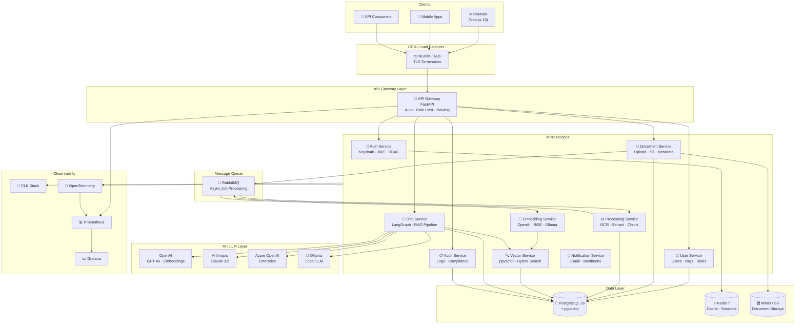
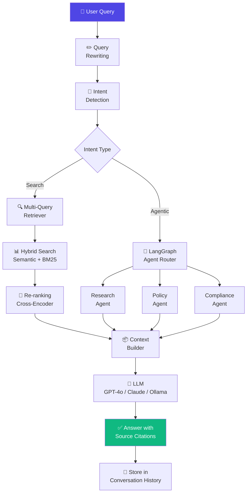
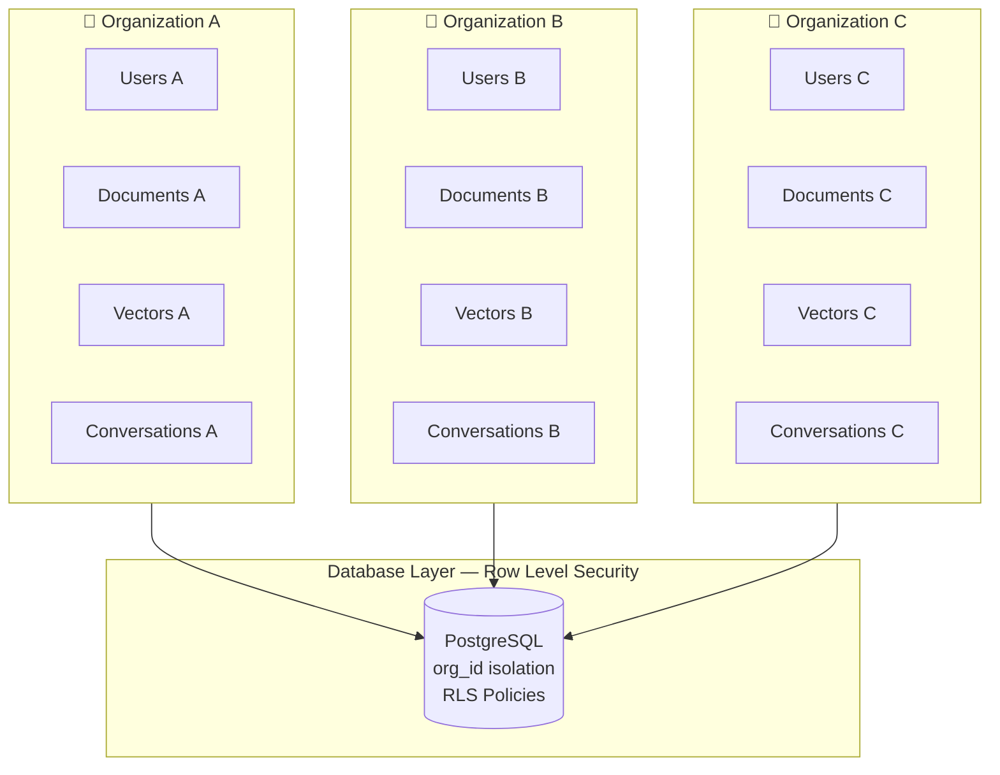
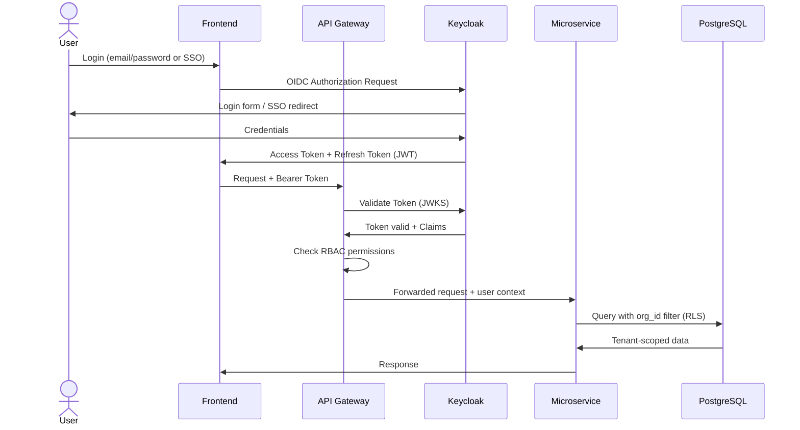
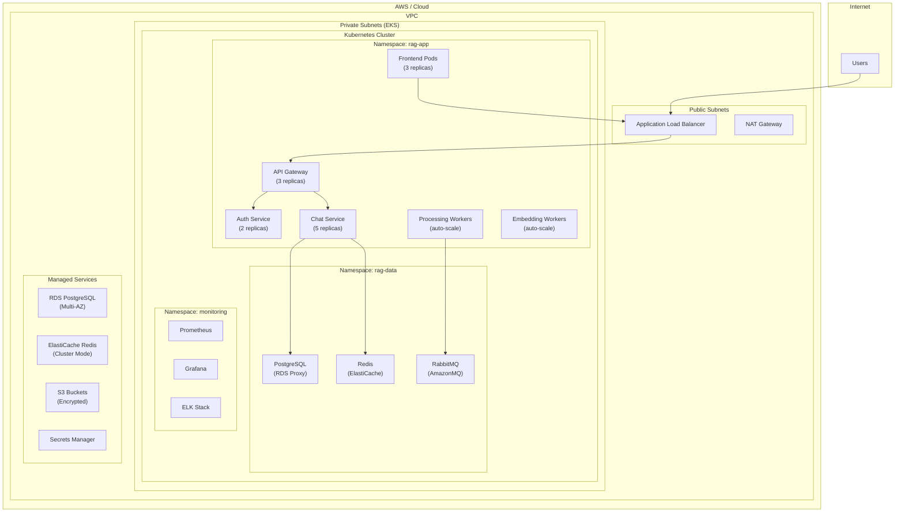
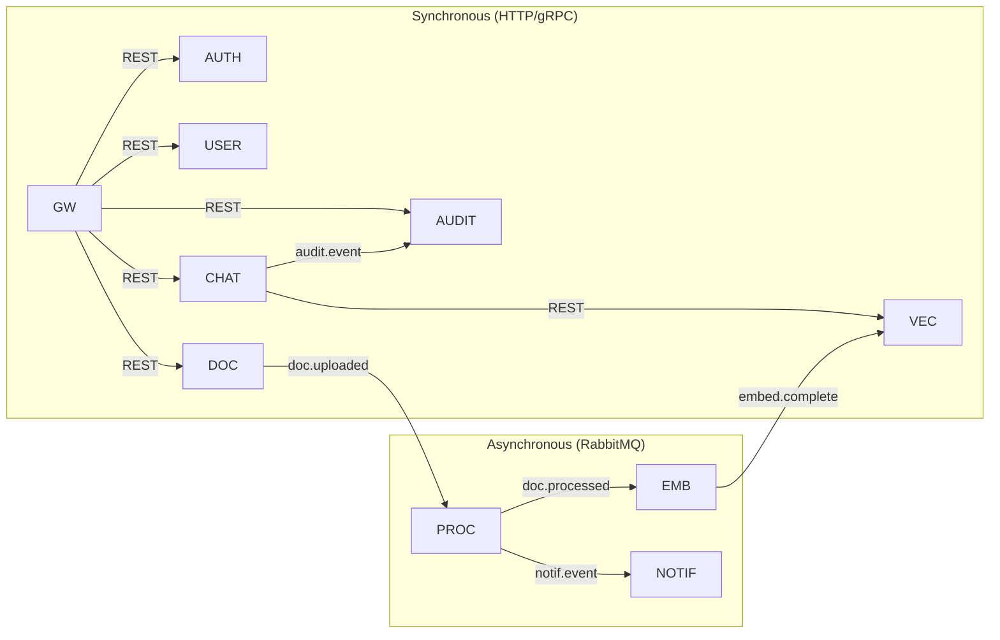
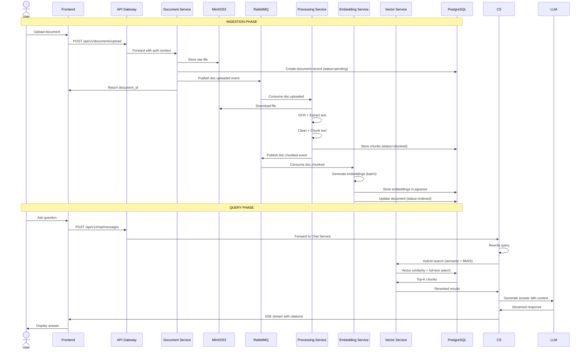

# Enterprise RAG Knowledge Assistant — System Architecture

## Overview

Multi-tenant, cloud-native RAG platform using a microservices architecture.

---

## High-Level System Architecture

---

## Document Ingestion Pipeline

```mermaid
flowchart LR
    A["📤 Upload"] --> B["🦠 Virus Scan\n(ClamAV)"]
    B --> C["📋 Validate\nType · Size"]
    C --> D["☁️ Store\nS3/MinIO"]
    D --> E["🔎 OCR\nTesseract/Azure DI"]
    E --> F["📝 Text\nExtraction"]
    F --> G["🧹 Clean &\nNormalize"]
    G --> H["✂️ Chunking\nStrategy"]
    H --> I["🧮 Generate\nEmbeddings"]
    I --> J["💾 Store\npgvector"]
    J --> K["✅ Index\nComplete"]

    style A fill:#4f46e5,color:#fff
    style K fill:#10b981,color:#fff
```

---

## RAG Query Pipeline

---

## Multi-Tenancy Architecture

---

## Authentication & RBAC Flow

---

## Deployment Architecture (Kubernetes)

---

## Service Communication

---

## Data Flow Sequence — Document Upload to Query

